#Configuração para Conexão com o Banco de Dados
Deve ser efetuado o download do MySQL Installer Community no link abaixo: 

[MySql Installer Community](https://dev.mysql.com/get/Downloads/MySQLInstaller/mysql-installer-community-8.0.36.0.msi)

E seguir os passos abaixo:

Basicamente, após a inicialização do instalador, deve-se clicar em 'Next' continuadamente, sendo apenas necessário customização no momento de definir a senha do usuário 'root' e adicionar outros usuários.

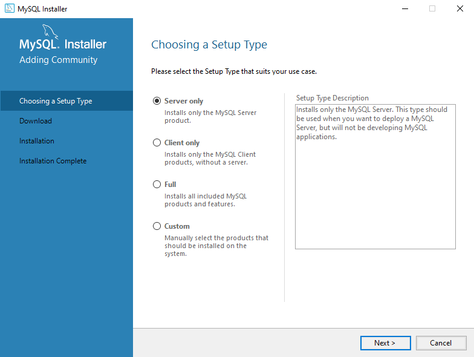
Clicar em 'Next'
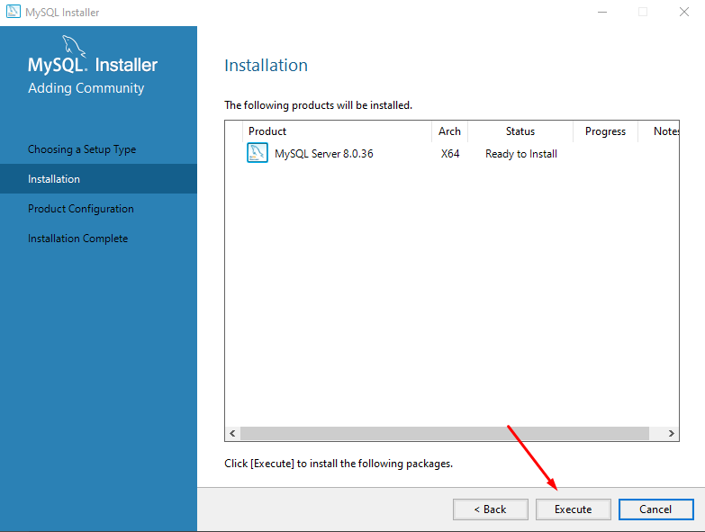
Clicar em 'Execute'
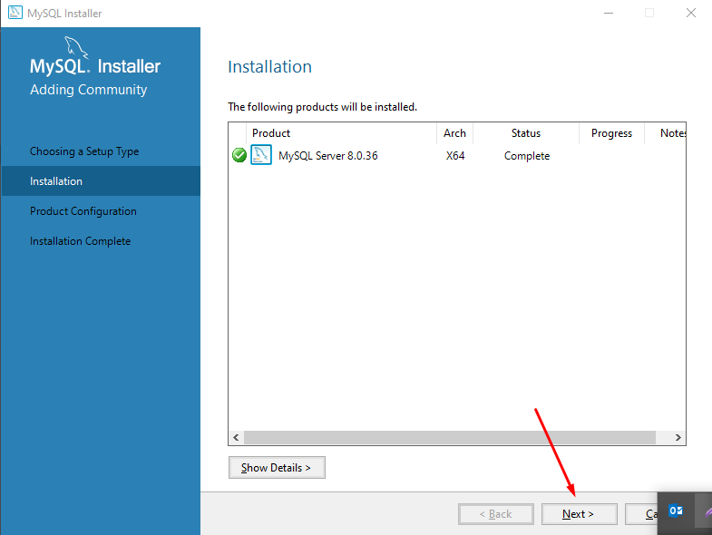
Clicar em 'Next'

Clicar em 'Next'
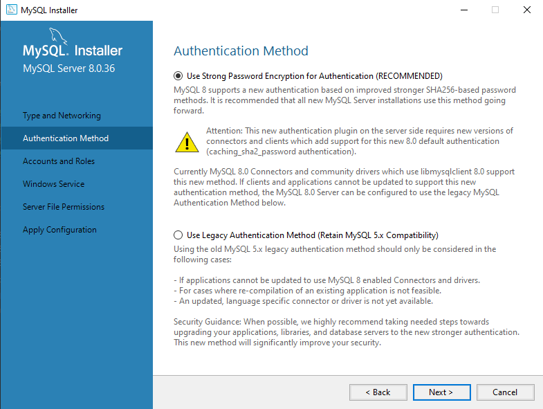
Clicar em 'Next'
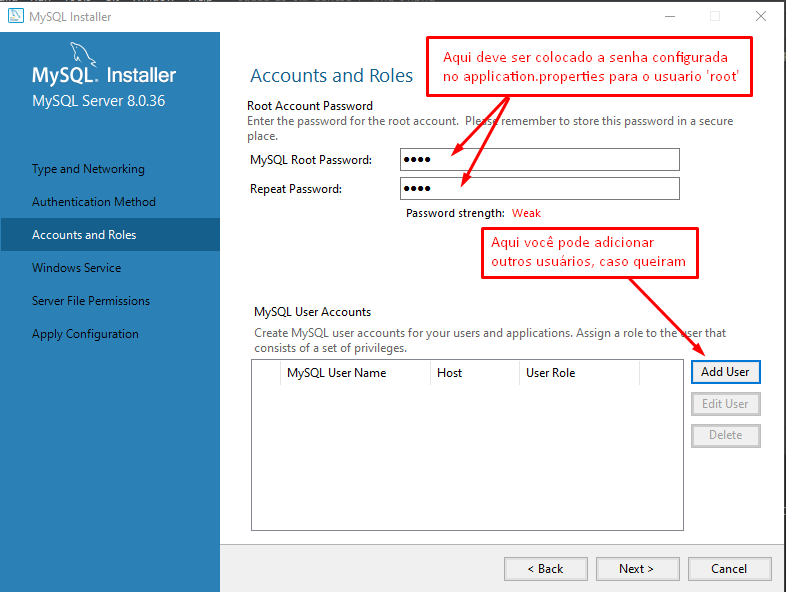
Escolher a senha do usuário root
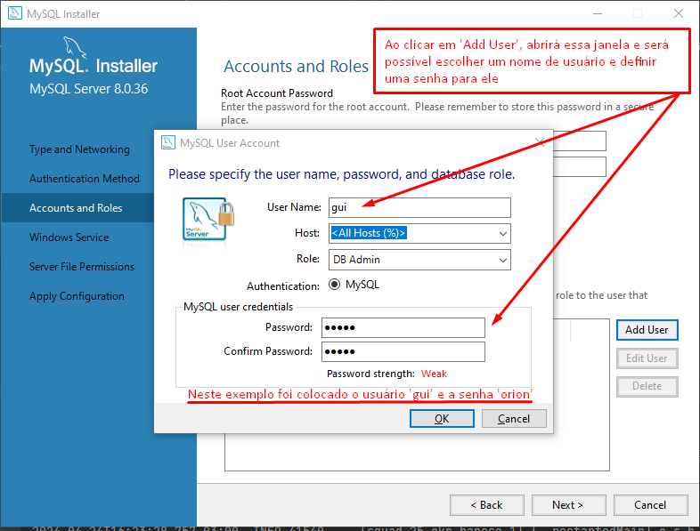
Adicionar usuários novos
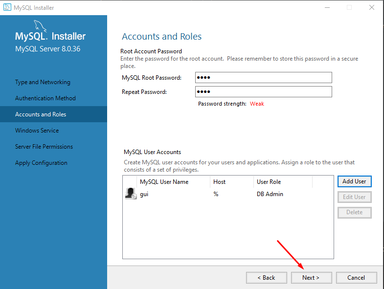
Clicar em 'Next'
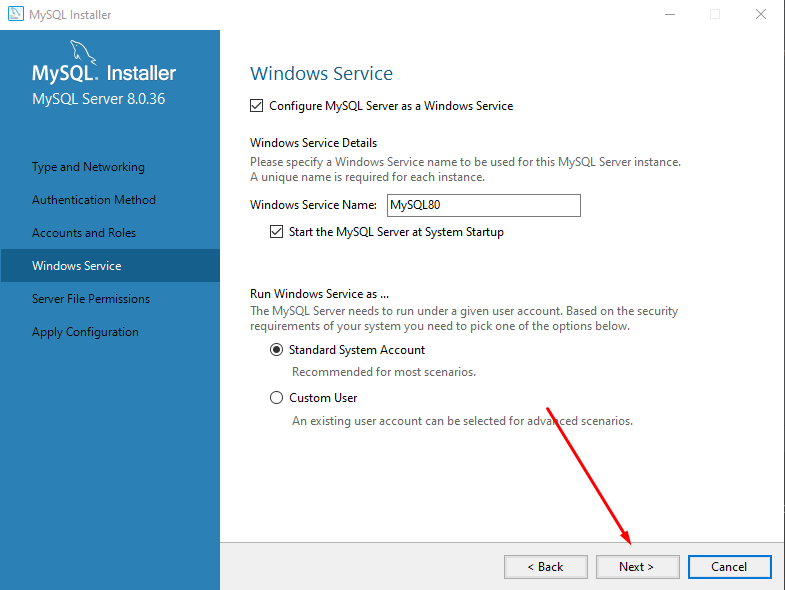
Clicar em 'Next'
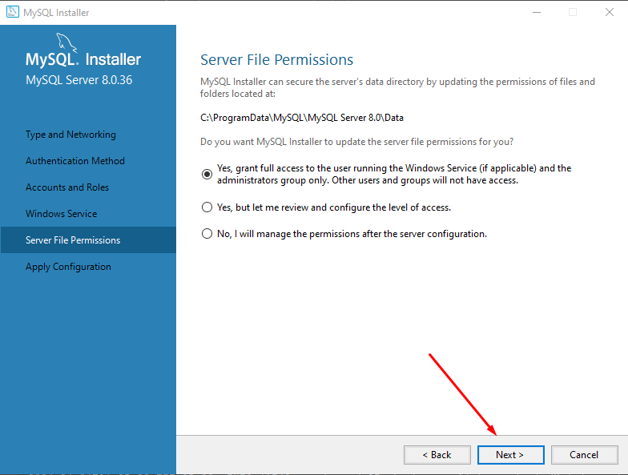
Clicar em 'Next'
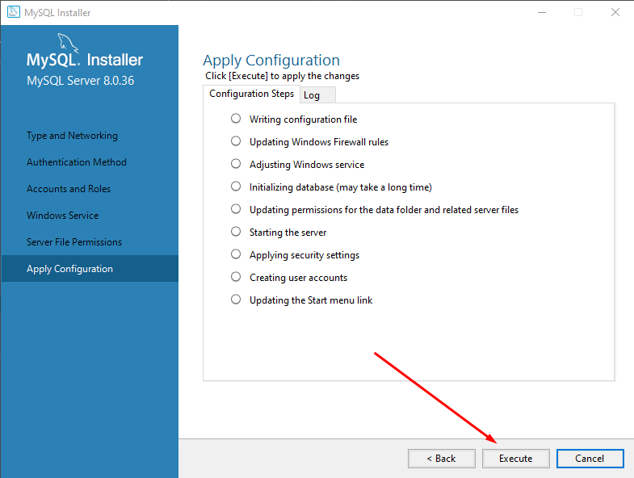
Clicar em 'Execute'
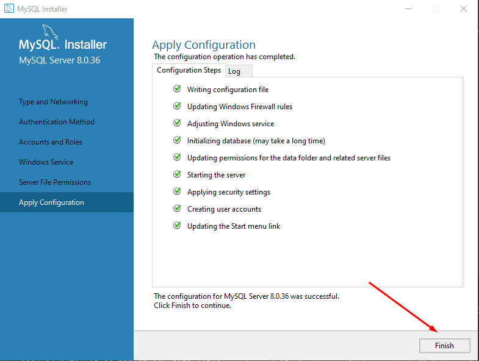
Clicar em 'Finish'
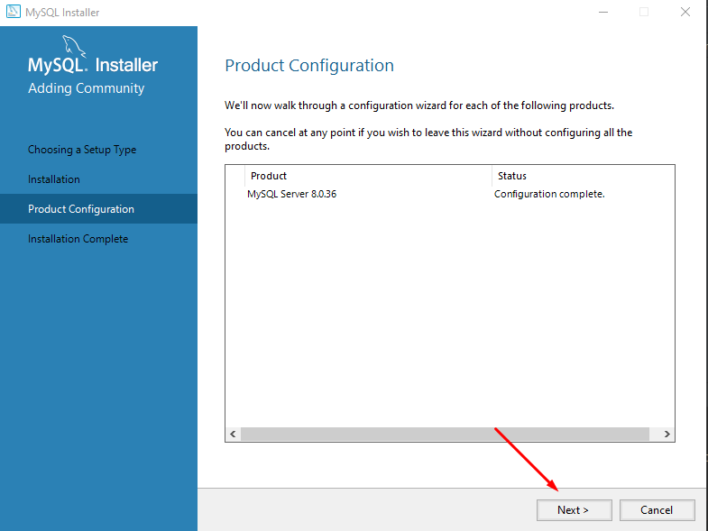
Clicar em 'Next' e após essa tela, haverá outra para clicar em finish.

Após essa instalação, deve-se criar uma conexão pelo dbeaver, escolher a opção url e colar a url configurada no application properties, que é:
`jdbc:mysql://localhost:3306/?allowPublicKeyRetrieval=true&useSSL=false` e colocar algum usuário e senha configurados.
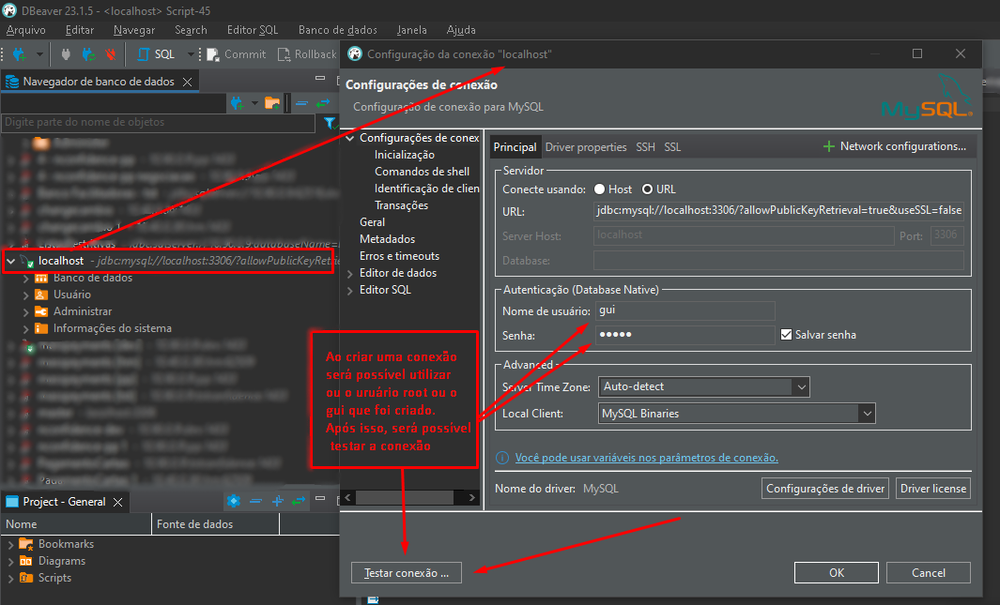
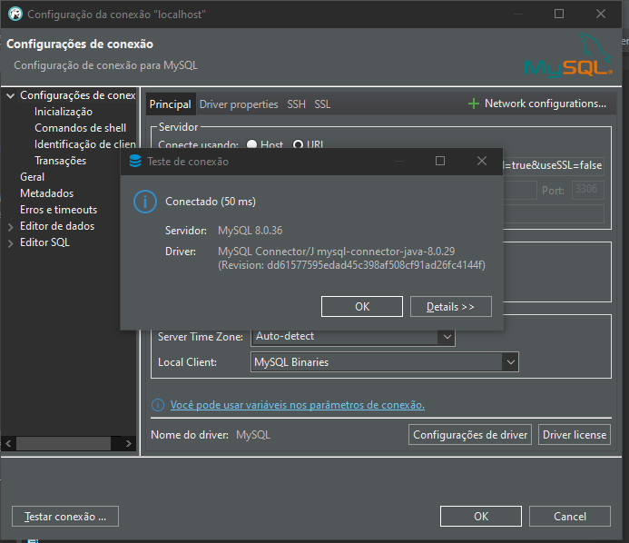

Após essa configuração, o projeto se conectará ao banco de dados sem problemas.

